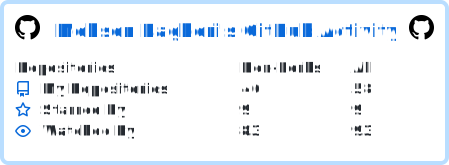

# MohsenBg Archive Questions 📚
This is a collection of the questions I've solved. You can check how I solve them, and if you have any questions or ideas 💡, feel free to share them with me! 

## Statify Analysis

### Bottom Legend

### Left Legend

- [Mermaid Chart Example](./analyzed/test_user_stats/mds/mermaid_chart.md)
- [Files Analyzed](./analyzed/test_user_stats/mds/mermaid_chart.md)

### Other Analyzed Files

- [Analyzed Data](./analyzed)

## custom one

## userstats

## languages

## repos

## contribs

### List of Questions
* [jump_game](./jump_game/README.md) 🎮
* [remove_duplicates_from_sorted_array](./remove_duplicates_from_sorted_array/README.md) 🔄
* [two_sum](./two_sum/README.md)
