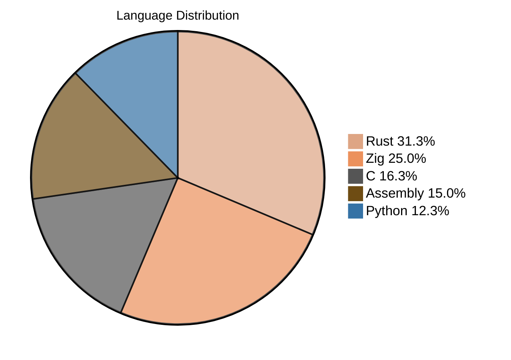

```mermaid
%%{
  init: {
    "themeVariables": {
      "pie1": "#DEA584",
      "pie2": "#EC915C",
      "pie3": "#555555",
      "pie4": "#6E4C13",
      "pie5": "#3572A5",
      "pieSectionTextSize": "0",
      "pieTitleTextSize": "16.00px"
    }
  }
}%%

pie
  title Language Distribution
  "Rust 31.3%": 31.341066
  "Zig 25.0%": 25.028758
  "C 16.3%": 16.324770
  "Assembly 15.0%": 14.987538
  "Python 12.3%": 12.317868
```
